# 🤖 NVIDIA NeMo PDF Chat Demo

A **Retrieval-Augmented Generation (RAG)** demo built with **NVIDIA NeMo**, enabling users to upload PDFs and interact with their content using natural language questions. This Streamlit app combines document ingestion, embedding, retrieval, and large language model (LLM) generation into an intuitive pipeline.

---

## 🌐 Overview

This application allows users to:

- Upload one or more PDF files.
- Parse and chunk the text using `PyPDFLoader` and `RecursiveCharacterTextSplitter`.
- Create semantic embeddings using `NVIDIAEmbeddings`.
- Store and search document chunks in a `FAISS` vector index.
- Retrieve relevant information based on a user's query.
- Use `meta/llama3-70b-instruct` LLM from NVIDIA to generate an accurate answer grounded in context.

---

## 🧠 What Is RAG?

**Retrieval-Augmented Generation (RAG)** is a technique where a language model is not solely dependent on its pre-trained knowledge. Instead, it retrieves relevant context from external data (in this case, PDF documents) and uses that context to generate responses. This leads to:

- More accurate answers
- Dynamic knowledge injection
- Reduced hallucination

---

## 🧰 Tech Stack

- 🧠 **NVIDIA NeMo NIM** (LLM + Embeddings)
- 📄 **LangChain** for chaining components
- 📚 **FAISS** for fast similarity search
- 📥 **PyPDFLoader** for PDF ingestion
- 🧩 **RecursiveCharacterTextSplitter** for chunking
- 💬 **Streamlit** frontend interface

---


## 🏗️ Architecture Diagram

```mermaid
flowchart TD
    A[📁 User Uploads PDFs] --> B[📄 PyPDFLoader loads documents]
    B --> C[🔗 Text Splitter chunks text]
    C --> D[🧠 Generate NVIDIA Embeddings]
    D --> E[🗂️ Store in FAISS Vector Store]

    F[❓ User asks a question] --> G[🔍 Retriever fetches relevant chunks]
    G --> H[📦 Prompt Template with context]
    H --> I[🤖 meta/llama3-70b-instruct NVIDIA ChatNVIDIA]
    I --> J[💬 Answer + Sources displayed in Streamlit]
```



## 🧬 Architecture Explanation
### 1. PDF Upload (📁)
Users upload one or more PDF files via the Streamlit sidebar. Each file is temporarily saved for processing.

### 2. Document Loading (📄)
PyPDFLoader reads each PDF and converts it into a list of LangChain Document objects. Each object contains the text content and metadata (e.g., page number).

### 3. Text Chunking (🔗)
Using RecursiveCharacterTextSplitter, long documents are split into smaller, manageable chunks (~700 characters with 50-character overlap). Overlapping chunks ensure better context recall during retrieval.

### 4. Vector Embeddings (🧠)
NVIDIAEmbeddings computes high-dimensional embeddings (vectors) for each text chunk using NVIDIA's foundation models. These embeddings capture the semantic meaning of the chunks.

### 5. Vector Store (🗂️)
Embeddings are stored in a FAISS (Facebook AI Similarity Search) index. FAISS allows for fast similarity search by comparing query vectors to stored document vectors.

### 6. User Query Input (❓)
The user enters a natural language question in the main interface.

### 7. Retriever (🔍)
The query is embedded and compared with stored vectors using FAISS. The top-k most relevant document chunks are returned.

### 8. Prompt Composition (📦)
A ChatPromptTemplate creates a structured prompt with retrieved context and the user’s question. This prompt guides the LLM to base its response only on the provided documents.

### 9. LLM Generation (🤖)
ChatNVIDIA with meta/llama3-70b-instruct generates a coherent, grounded answer. The model uses both the prompt and context to answer accurately and concisely.

### 10. Result Display (💬)
The final answer is shown to the user. A breakdown of the source document chunks used in generating the response is provided for transparency.
Response time is also displayed.

## ✅ Benefits of This RAG Architecture
- Explainable AI: Displays source documents for validation.

- Scalable: Easily extendable to many documents and users.

- Enterprise-Ready: Secure and controlled knowledge retrieval.

- Low Hallucination Risk: Answers grounded in actual documents.


## ⚙️ Installation
Clone this repository:

```bash
git clone https://github.com/your-username/nemo-pdf-chat-demo.git
cd nemo-pdf-chat-demo
```
Create a virtual environment and activate it:
```bash
python -m venv venv
source venv/bin/activate  # or venv\Scripts\activate on Windows
```
Install dependencies:

```bash
pip install -r requirements.txt
```
Create a .env file:

```bash
env
NVIDIA_API_KEY=your_nvidia_api_key_here
```
## 🧪 Run the App
```bash
streamlit run app.py
```
Then open http://localhost:8501 in your browser.


📄 License
This project is licensed under the MIT License.

